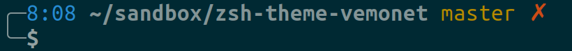
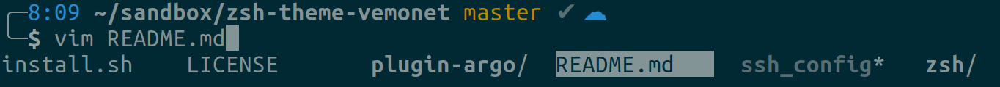

A simple [oh-my-zsh](https://ohmyz.sh/) theme based on the Bira theme. The username has been removed as I usually don't need it to be display all the time and the time has been added (can be useful to see the time a command took to run)

What is [installed](https://github.com/vemonet/zsh-theme-vemonet/blob/master/install.sh):

* [oh-my-zsh](https://ohmyz.sh/)
* A custom [oh-my-zsh](https://ohmyz.sh/) theme based on Bira (replacing username by time)
* Completion for the `ssh` command based on your [~/.ssh/config](https://github.com/vemonet/zsh-theme-vemonet/blob/master/ssh_config) file. 
  * Take a look at the [ssh_config](https://github.com/vemonet/zsh-theme-vemonet/blob/master/ssh_config) file to see how to define your SSH connections using different identity files and usernames.
* A better `yarn` completion for ZSH (the default one doesn't work properly on Ubuntu and MacOS)
* Following autocompletion plugins are activated in [.zshrc](https://github.com/vemonet/zsh-theme-vemonet/blob/master/zsh/.zshrc#L22): 
  * `docker oc kubectl mvn ansible aws yarn-completion`
  * Those interesting plugins seems to not work: `pip yarn docker-compose npm npx`

## Clone

Clone the repository and go inside.

```bash
git clone https://github.com/vemonet/zsh-theme-biradate.git
cd zsh-theme-biradate
```

## Install it

First install ZSH:

```bash
# On Linux
sudo apt-get update
sudo apt install zsh

# On MacOS
brew install zsh
```

Then make sure the [install.sh](https://github.com/vemonet/zsh-theme-vemonet/blob/master/install.sh) script does not install things you don't want, and run it:

```bash
./install.sh
```

> You might want to change the .ssh/config file (set with examples) before running the install. 

> ⚠️ An alias to use automatically `pip3` when `pip` is used is created at the end of [.zshrc](https://github.com/vemonet/zsh-theme-vemonet/blob/master/zsh/.zshrc). Remove it if you don't want it (N.B: Python 2.7 is not supported anymore).

## Solarized Gnome terminal

Install [Solarized color](https://github.com/aruhier/gnome-terminal-colors-solarized) for the Gnome terminal:

```bash
git clone https://github.com/aruhier/gnome-terminal-colors-solarized.git
cd gnome-terminal-colors-solarized
./install.sh
```

## What it looks like

In Gnome Terminal with Solarized colors.

* When there are uncommited changes on the current Git repository:



* When no changes to commit, with indicator that there are changes that needs to be pushed to GitHub/GitLab:



## Change the color

If you already installed the theme, you can put the `red` one instead:

```bash
cp zsh/vemonet_bira-red.zsh-theme ~/.oh-my-zsh/custom/themes/vemonet_bira.zsh-theme
```

You can change the color the time (instead of blue or red) before installing the theme

```bash
nano zsh/vemonet_bira.zsh-theme

# Change "blue" in the following line
local current_dir='%{$terminfo[bold]$fg[blue]%} %~%{$reset_color%}'
```


 